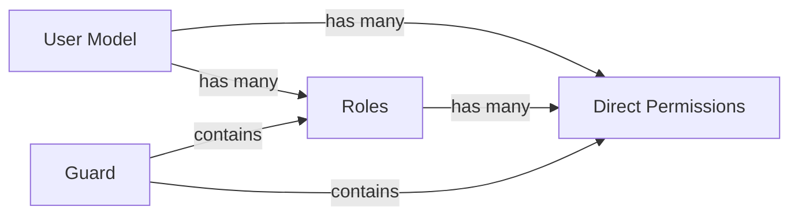

## Core Concepts

Laravel Permission is built around three fundamental concepts that work together to provide flexible authorization:

<CardGroup cols={3}>
  <Card title="Permissions" icon="key">
    Individual abilities that can be granted to users (e.g., 'edit articles')
  </Card>
  <Card title="Roles" icon="user-tag">
    Groups of permissions that can be assigned to users (e.g., 'editor' role)
  </Card>
  <Card title="Guards" icon="shield">
    Authentication contexts that separate permissions (e.g., 'web' vs 'api')
  </Card>
</CardGroup>

## Permissions

A permission is a single ability that represents an action a user can perform in your application.

### What is a Permission?

<Note>
  A permission is the most granular level of access control. It represents a specific action like "edit articles" or "delete users".
</Note>

Permissions are stored in the database using the `Permission` model and have two main attributes:

- **name**: The permission identifier (e.g., 'edit articles')
- **guard_name**: The authentication guard this permission belongs to (e.g., 'web')

### Creating Permissions

You can create permissions in several ways:

<CodeGroup>
```php Using create()
use Spatie\Permission\Models\Permission;

// Create a single permission
Permission::create(['name' => 'edit articles']);

// Create with explicit guard
Permission::create([
    'name' => 'edit articles',
    'guard_name' => 'api'
]);
```

```php Using findOrCreate()
// Create if doesn't exist, or return existing
$permission = Permission::findOrCreate('edit articles');
$permission = Permission::findOrCreate('edit articles', 'api');
```

```php Bulk Creation
$permissions = [
    'edit articles',
    'delete articles',
    'publish articles',
    'unpublish articles',
];

foreach ($permissions as $permission) {
    Permission::findOrCreate($permission);
}
```

```php In Seeder
use Illuminate\Database\Seeder;
use Spatie\Permission\Models\Permission;

class PermissionSeeder extends Seeder
{
    public function run(): void
    {
        $permissions = [
            'create articles',
            'edit articles',
            'delete articles',
            'publish articles',
        ];

        foreach ($permissions as $permission) {
            Permission::create(['name' => $permission]);
        }
    }
}
```
</CodeGroup>

### Finding Permissions

```php
// Find by name
$permission = Permission::findByName('edit articles');
$permission = Permission::findByName('edit articles', 'api');

// Find by ID
$permission = Permission::findById(1);
$permission = Permission::findById(1, 'web');
```

### Permission Naming Conventions

<Tip>
  Use descriptive, action-based names for permissions. Common patterns include:
  - Resource + Action: `articles.create`, `articles.edit`, `articles.delete`
  - Verb + Noun: `create articles`, `edit articles`, `delete articles`
  - Simple actions: `publish`, `moderate`, `administrate`
</Tip>

## Roles

A role is a named group of permissions that can be assigned to users for easier permission management.

### What is a Role?

<Note>
  Roles group related permissions together. Instead of granting 10 individual permissions to a user, you can create an "Editor" role with those permissions and assign the role.
</Note>

Roles have the same basic structure as permissions:

- **name**: The role identifier (e.g., 'editor', 'admin')
- **guard_name**: The authentication guard this role belongs to

### Creating Roles

<CodeGroup>
```php Basic Creation
use Spatie\Permission\Models\Role;

// Create a role
$role = Role::create(['name' => 'writer']);
$role = Role::create(['name' => 'editor', 'guard_name' => 'api']);
```

```php With Permissions
// Create role and assign permissions
$role = Role::create(['name' => 'editor']);
$role->givePermissionTo([
    'edit articles',
    'delete articles',
    'publish articles'
]);
```

```php Find or Create
// Get existing or create new
$role = Role::findOrCreate('admin');
$role = Role::findOrCreate('admin', 'web');
```

```php Complete Example
use Spatie\Permission\Models\{Permission, Role};

// Create permissions
$editPermission = Permission::create(['name' => 'edit articles']);
$deletePermission = Permission::create(['name' => 'delete articles']);
$publishPermission = Permission::create(['name' => 'publish articles']);

// Create writer role with limited permissions
$writer = Role::create(['name' => 'writer']);
$writer->givePermissionTo([
    'edit articles',
    'delete articles'
]);

// Create editor role with more permissions
$editor = Role::create(['name' => 'editor']);
$editor->givePermissionTo([
    'edit articles',
    'delete articles',
    'publish articles'
]);
```
</CodeGroup>

### Finding Roles

```php
// Find by name
$role = Role::findByName('editor');
$role = Role::findByName('editor', 'api');

// Find by ID
$role = Role::findById(1);
$role = Role::findById(1, 'web');
```

### Role Hierarchies

<Warning>
  Laravel Permission does **not** implement role hierarchies by default. Each role is independent and must explicitly have the permissions it needs.
</Warning>

If you need role hierarchies (e.g., Admin inheriting Editor permissions), you can implement them yourself:

```php
// Create base roles
$writer = Role::create(['name' => 'writer']);
$writer->givePermissionTo(['edit articles', 'delete articles']);

$editor = Role::create(['name' => 'editor']);
// Editor gets writer permissions plus additional ones
$editor->givePermissionTo([
    'edit articles',
    'delete articles',
    'publish articles',
    'unpublish articles'
]);

$admin = Role::create(['name' => 'admin']);
// Admin gets all permissions
$admin->givePermissionTo(Permission::all());
```

## Guards

Guards represent different authentication contexts in your application, allowing you to have separate permission systems for different user types.

### What is a Guard?

<Info>
  Guards are Laravel's way of defining different authentication systems. The `web` guard typically uses session-based authentication, while the `api` guard might use token-based authentication.
</Info>

Common use cases for multiple guards:
- **Web vs API**: Different permissions for web users and API consumers
- **Admin Panel**: Separate admin authentication with different permissions
- **Multi-tenant**: Different permission sets per tenant type

### Default Guard

The default guard is determined from your `config/auth.php` file:

```php config/auth.php
'defaults' => [
    'guard' => 'web',
],
```

When you create permissions or roles without specifying a guard, they use the default guard.

### Working with Multiple Guards

<CodeGroup>
```php Creating with Guards
// Web guard (default)
$webPermission = Permission::create(['name' => 'edit articles']);
$webRole = Role::create(['name' => 'editor']);

// API guard
$apiPermission = Permission::create([
    'name' => 'edit articles',
    'guard_name' => 'api'
]);

$apiRole = Role::create([
    'name' => 'editor',
    'guard_name' => 'api'
]);
```

```php Assigning with Guards
// Assign role to user with specific guard
$user->assignRole('editor'); // Uses default guard
$apiUser->assignRole('editor', 'api'); // Uses API guard

// Check permission with guard
$user->hasPermissionTo('edit articles', 'web');
$apiUser->hasPermissionTo('edit articles', 'api');
```

```php Guard Validation
// Permissions and roles are guard-specific
Permission::create(['name' => 'edit articles', 'guard_name' => 'web']);
Permission::create(['name' => 'edit articles', 'guard_name' => 'api']);

// These are treated as different permissions!
$webPermission = Permission::findByName('edit articles', 'web');
$apiPermission = Permission::findByName('edit articles', 'api');

$webPermission->id !== $apiPermission->id; // true
```
</CodeGroup>

<Warning>
  You cannot assign a permission from one guard to a user authenticated with a different guard. Laravel Permission will throw a `GuardDoesNotMatch` exception.
</Warning>

### Custom Guards

You can create custom guards in `config/auth.php`:

```php config/auth.php
'guards' => [
    'web' => [
        'driver' => 'session',
        'provider' => 'users',
    ],

    'api' => [
        'driver' => 'token',
        'provider' => 'users',
    ],
    
    'admin' => [
        'driver' => 'session',
        'provider' => 'admins',
    ],
],
```

Then create permissions and roles for that guard:

```php
Permission::create(['name' => 'manage users', 'guard_name' => 'admin']);
$adminRole = Role::create(['name' => 'super-admin', 'guard_name' => 'admin']);
```

## Relationship Between Concepts

Understanding how these concepts relate is crucial:



### Direct vs Role-Based Permissions

Users can receive permissions in two ways:

<CardGroup cols={2}>
  <Card title="Direct Permissions" icon="arrow-right">
    Permissions assigned directly to the user
    
    ```php
    $user->givePermissionTo('edit articles');
    ```
  </Card>
  
  <Card title="Role-Based Permissions" icon="users">
    Permissions inherited from assigned roles
    
    ```php
    $role = Role::create(['name' => 'editor']);
    $role->givePermissionTo('edit articles');
    $user->assignRole('editor');
    ```
  </Card>
</CardGroup>

<Note>
  When checking if a user has a permission, Laravel Permission checks **both** direct permissions and permissions from roles.
</Note>

### Permission Check Flow

Here's how permission checks work:

<Steps>
  <Step title="Check Direct Permissions">
    First, check if the user has the permission directly assigned via `givePermissionTo()`.
  </Step>
  
  <Step title="Check Role Permissions">
    If not found, check if any of the user's roles have that permission.
  </Step>
  
  <Step title="Return Result">
    Return `true` if found in either source, `false` otherwise.
  </Step>
</Steps>

```php
// User has direct permission
$user->givePermissionTo('edit articles');
$user->can('edit articles'); // true

// User has permission via role
$role = Role::create(['name' => 'editor']);
$role->givePermissionTo('publish articles');
$user->assignRole('editor');
$user->can('publish articles'); // true

// User has no access
$user->can('delete users'); // false
```

## Best Practices

<AccordionGroup>
  <Accordion title="Use Roles for Common Permission Sets">
    Group related permissions into roles instead of assigning many individual permissions to users:
    
    ```php
    // ✅ Good: Use roles
    $editor = Role::create(['name' => 'editor']);
    $editor->givePermissionTo(['edit', 'publish', 'delete']);
    $user->assignRole('editor');
    
    // ❌ Avoid: Individual permissions
    $user->givePermissionTo(['edit', 'publish', 'delete', ...]);
    ```
  </Accordion>

  <Accordion title="Use Direct Permissions for Exceptions">
    Use direct permissions for special cases or temporary access:
    
    ```php
    // User is a writer but needs temporary publish access
    $user->assignRole('writer');
    $user->givePermissionTo('publish articles');
    ```
  </Accordion>

  <Accordion title="Consistent Naming">
    Use a consistent naming convention throughout your application:
    
    ```php
    // Choose one style and stick with it
    // Dot notation
    'articles.create', 'articles.edit', 'articles.delete'
    
    // Or space notation
    'create articles', 'edit articles', 'delete articles'
    ```
  </Accordion>

  <Accordion title="Seed Permissions Early">
    Create all your permissions and roles in a seeder that runs during deployment:
    
    ```php
    class PermissionSeeder extends Seeder
    {
        public function run(): void
        {
            // Clear cache
            app()[PermissionRegistrar::class]->forgetCachedPermissions();
            
            // Create all permissions
            // Create all roles
            // Assign permissions to roles
        }
    }
    ```
  </Accordion>

  <Accordion title="Use Gates and Policies">
    Leverage Laravel's authorization features alongside this package:
    
    ```php
    // In a Policy
    public function update(User $user, Article $article)
    {
        return $user->can('edit articles') && 
               $user->id === $article->author_id;
    }
    ```
  </Accordion>
</AccordionGroup>

## Next Steps

Now that you understand the core concepts:

<CardGroup cols={2}>
  <Card title="Using Permissions" icon="code" href="/basic-usage/using-permissions">
    Learn how to assign and check permissions in your application
  </Card>
  <Card title="Blade Directives" icon="code" href="/basic-usage/using-blade-directives">
    Use permissions in your views
  </Card>
</CardGroup>
