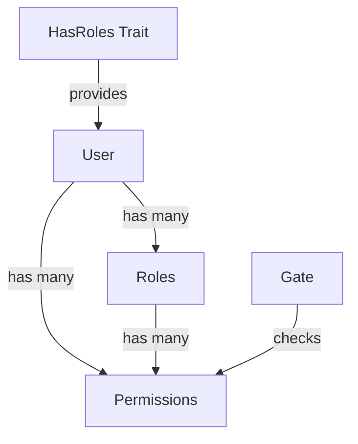

## Welcome to Laravel Permission

Laravel Permission is a powerful package that allows you to manage user permissions and roles in your Laravel application using a database. Built by [Spatie](https://spatie.be), this package provides an elegant way to implement role-based access control (RBAC) in your applications.

<CardGroup cols={2}>
  <Card title="Simple & Intuitive" icon="wand-magic-sparkles">
    Clean API for assigning roles and permissions with minimal boilerplate
  </Card>
  <Card title="Laravel Integration" icon="code">
    Works seamlessly with Laravel's native authorization system and Gate
  </Card>
  <Card title="Flexible Guards" icon="shield">
    Support for multiple authentication guards out of the box
  </Card>
  <Card title="Team Support" icon="users">
    Built-in multi-tenancy support for team-based applications
  </Card>
</CardGroup>

## What It Does

This package allows you to manage user permissions and roles stored in a database. Once installed, you can easily control access to your application's features using an intuitive API.

### Quick Example

Here's a taste of what you can do with Laravel Permission:

<CodeGroup>
```php Direct Permissions
// Give a user permission directly
$user->givePermissionTo('edit articles');

// Check if user has permission
if ($user->can('edit articles')) {
    // User can edit articles
}
```

```php Role-Based Permissions
// Create a role with permissions
$role = Role::create(['name' => 'writer']);
$role->givePermissionTo('edit articles');

// Assign role to user
$user->assignRole('writer');

// User now has permission via role
$user->can('edit articles'); // true
```

```php Multiple Permissions
// Assign multiple permissions at once
$user->givePermissionTo(['edit articles', 'delete articles', 'publish articles']);

// Check for any permission
if ($user->hasAnyPermission(['edit articles', 'delete articles'])) {
    // User has at least one permission
}

// Check for all permissions
if ($user->hasAllPermissions(['edit articles', 'publish articles'])) {
    // User has all permissions
}
```

```php Blade Directives
{{-- Check permissions in views --}}
@can('edit articles')
    <a href="{{ route('articles.edit', $article) }}">Edit</a>
@endcan

@role('writer')
    <a href="{{ route('articles.create') }}">Create Article</a>
@endrole
```
</CodeGroup>

## Key Features

### Database-Driven Permissions

All permissions and roles are stored in your database, making them easy to manage dynamically through your application's admin interface.

### Seamless Laravel Integration

Because all permissions are registered on [Laravel's Gate](https://laravel.com/docs/authorization), you can use Laravel's native `can()` method to check permissions:

```php
// Works with Laravel's authorization
$user->can('edit articles');

// Works in controllers
$this->authorize('edit articles');

// Works in policies
Gate::allows('edit articles');
```

### Flexible Permission Assignment

Permissions can be assigned to users in two ways:

<CardGroup cols={2}>
  <Card title="Direct Permissions" icon="user">
    Assign permissions directly to individual users for fine-grained control
  </Card>
  <Card title="Role-Based Permissions" icon="user-group">
    Group permissions into roles and assign roles to users for easier management
  </Card>
</CardGroup>

### Guard Support

The package supports Laravel's authentication guards, allowing you to have different sets of permissions for different user types (e.g., web users, API users, admins).

```php
// Create permissions for different guards
Permission::create(['name' => 'edit articles', 'guard_name' => 'web']);
Permission::create(['name' => 'edit articles', 'guard_name' => 'api']);

// Assign role with specific guard
$user->assignRole('writer', 'web');
```

## Common Use Cases

<AccordionGroup>
  <Accordion title="Content Management Systems">
    Control who can create, edit, publish, or delete content. Assign roles like Editor, Author, and Contributor with different permission levels.
  </Accordion>
  
  <Accordion title="Multi-Tenant Applications">
    Use the built-in teams feature to isolate permissions between different organizations or workspaces.
  </Accordion>
  
  <Accordion title="Admin Panels">
    Restrict access to sensitive administrative features based on user roles and permissions.
  </Accordion>
  
  <Accordion title="API Authorization">
    Protect API endpoints by checking permissions, with support for different guards for web and API authentication.
  </Accordion>
</AccordionGroup>

## Architecture Overview

The package consists of three main components:



<Note>
  Users can have permissions both **directly** and **through roles**. When checking if a user has a permission, the package checks both sources.
</Note>

## Performance

The package is optimized for performance:

- **Caching**: All permissions are cached for 24 hours by default to speed up permission checks
- **Automatic Cache Invalidation**: Cache is automatically cleared when permissions or roles are updated
- **Eager Loading**: Relationships can be eager loaded to prevent N+1 query problems

```php
// Eager load relationships for better performance
$users = User::with(['roles', 'permissions'])->get();
```

## Next Steps

<CardGroup cols={2}>
  <Card title="Prerequisites" icon="list-check" href="/prerequisites">
    Check system requirements and dependencies
  </Card>
  <Card title="Installation" icon="download" href="/installation">
    Install the package and set up your database
  </Card>
  <Card title="Basic Concepts" icon="book" href="/basic-concepts">
    Learn about roles, permissions, and guards
  </Card>
  <Card title="Using Permissions" icon="code" href="/basic-usage/using-permissions">
    Start using permissions in your application
  </Card>
</CardGroup>

<Tip>
  Already familiar with the basics? Jump straight to the [Installation Guide](/installation) to get started!
</Tip>
